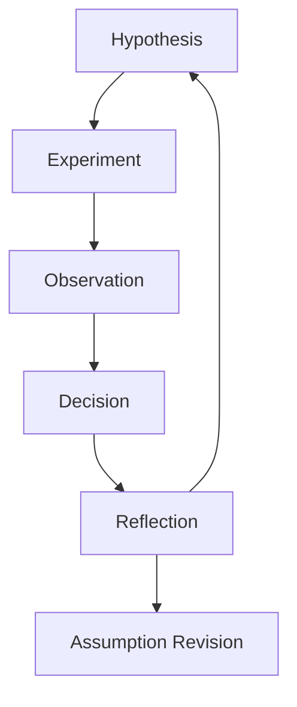

# RAE-CRL (Cognitive Research Loop)

**Scientific Research Overlay for Reflective Agentic Engine**

> **License:** Apache 2.0  
> **Status:** Research Preview / Early Access  
> **Core Dependency:** RAE-Core (agnostic memory engine)

---

## 1. Introduction

**RAE-CRL** is a cognitive scaffolding tool designed for researchers working in high-complexity, long-duration experimental environments. It operates as an overlay on top of the RAE (Reflective Agentic Engine), leveraging its memory and resonance capabilities to maintain the **continuity of scientific reasoning**.

Unlike traditional Electronic Lab Notebooks (ELN) which focus on data, or Project Management tools which focus on tasks, RAE-CRL focuses on **epistemic continuity**—preserving the *why* behind decisions, the *evolution* of hypotheses, and the *linkage* between failed experiments and future success.

### Key Characteristics

*   **Domain Agnostic:** Suitable for Bioengineering, Material Science, Physics, Chemistry, and Computer Science. No domain logic is hardcoded.
*   **Offline-First & Local:** Designed for air-gapped labs, field work, and sovereign data ownership. No cloud dependency.
*   **Decision-Centric:** Treats "Decisions" and "Reflections" as first-class citizens, equal to "Experiments".
*   **Deterministic Core:** Functional without LLMs. AI models are optional UX enhancers, not the source of truth.

---

## 2. Core Concepts: The Research Artifacts

RAE-CRL models the scientific process through six universal artifacts. These schemas are fixed in structure but extensible via metadata.

1.  **Hypothesis:** A proposed explanation or prediction (e.g., *"Material X will degrade above 100°C due to oxidation"*).
2.  **Assumption:** Axioms or preconditions taken for granted (e.g., *"The chamber humidity sensor is calibrated to ±1%"*).
3.  **Experiment:** A concrete procedure to test a hypothesis (e.g., *"Thermal cycling protocol A-12"*).
4.  **Observation:** Raw or summarized empirical output (e.g., *"Sample fractured at cycle 4"*).
5.  **Decision:** An explicit choice made based on observations (e.g., *"Abandoning Protocol A, switching to Protocol B with reduced pressure"*).
6.  **Reflection:** Meta-cognitive analysis of the process (e.g., *"We consistently underestimate thermal lag in the chamber"*).

---

## 3. The Cognitive Research Loop

Research is modeled not as a linear pipeline, but as a loop of reasoning:



RAE-CRL allows researchers to traverse this graph backwards in time, answering questions like:
*   *"Why did we change the pressure parameter six months ago?"*
*   *"What assumption turned out to be false in the previous project?"*

---

## 4. Architecture & Deployment

RAE-CRL is designed to run in two primary modes:

*   **Native (Lab Mode):** Running directly on the host (e.g., Arch Linux laptop), interacting via CLI/TUI. Ideal for low-latency, hands-on work in laboratories.
*   **Dockerized (Team/Server Mode):** encapsulated environment for reproducibility and team collaboration.

It connects to `rae-core` as its persistent memory store.

---

## 5. Usage

*Detailed CLI documentation and installation instructions will be provided in the `docs/` directory.*

### Example Workflow (CLI)

```bash
# Start a new research context
rae-crl init --project "Microplastics-3D-Thermal"

# Log a hypothesis
rae-crl add hypothesis "PET-G reinforced with 2% micro-particles increases thermal stability"

# Log an experiment linked to hypothesis
rae-crl add experiment --link-latest "Cycle test -40C to +80C"

# ... after 6 months ...
rae-crl query "decisions regarding thermal stability"
```

---

## 6. Contribution

We welcome contributions from researchers of all disciplines. Please refer to `CONTRIBUTING.md` (coming soon) for guidelines on extending metadata schemas and CLI adapters.
